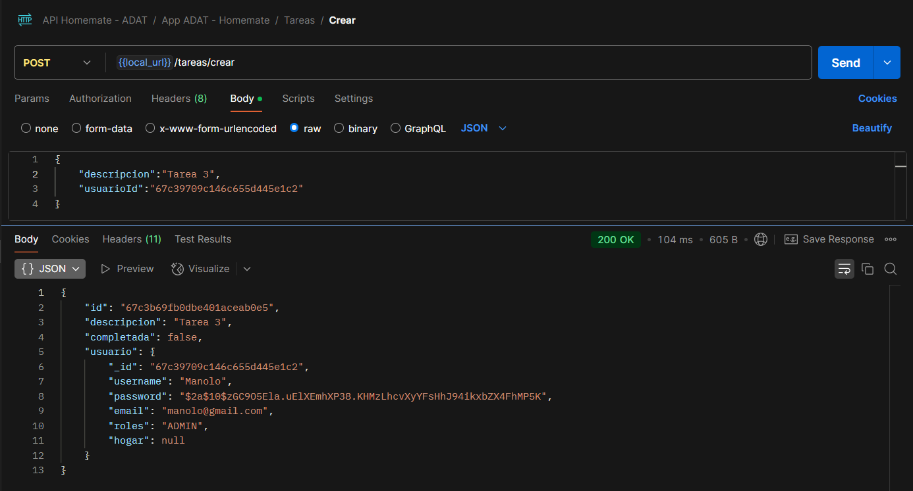
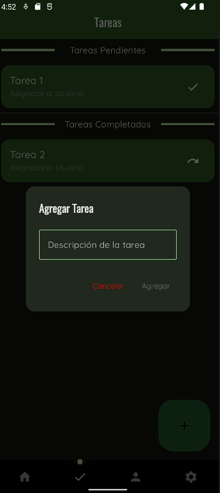

# 📝 Pruebas de Gestión de Tareas

Esta sección documenta las pruebas realizadas sobre el endpoint de **Tareas**, incluyendo capturas de **Postman** y de la aplicación móvil.

***

### 📚 **Índice**

* 📝 Creación de Tareas
  * ✅ Crear tarea correctamente
  * ❌ Intentar crear tarea con campos vacíos
* 📋 Listado de Tareas
  * ✅ Ver listado de tareas propias
  * ❌ Intentar ver tareas sin autenticación
* ✔️ Marcar Tareas
  * ✅ Marcar tarea como hecha
  * ❌ Intentar marcar tarea que no pertenece al usuario
* 🗑 Eliminación de Tareas
  * ✅ Eliminar tarea propia
  * ❌ Intentar eliminar tarea que no pertenece al usuario
  * ✅ Eliminar tarea como ADMIN
  * ❌ Intentar eliminar tarea inexistente

***

### 📝 **Creación de Tareas**

#### ✅ **Crear tarea correctamente**

**Descripción:** Se crea una tarea correctamente y la API responde con `201 Created`.

📸 **Captura en Postman:**

<figure><figcaption></figcaption></figure>

📱 **Captura en la App:**

<figure><figcaption></figcaption></figure>

***

#### ❌ **Intentar crear tarea con campos vacíos**

**Descripción:** Se intenta crear una tarea sin completar todos los campos obligatorios. La API devuelve `400 Bad Request`.

📸 **Captura en Postman:**

<figure><figcaption></figcaption></figure>

📱 **Captura en la App:**

<figure><figcaption></figcaption></figure>

***

### 📋 **Listado de Tareas**

#### ✅ **Ver listado de tareas propias**

**Descripción:** Se consulta correctamente la lista de tareas asignadas al usuario autenticado. La API devuelve `200 OK`.

📸 **Captura en Postman:**

<figure><figcaption></figcaption></figure>

📱 **Captura en la App:**

<figure><figcaption></figcaption></figure>

***

#### ❌ **Intentar ver tareas sin autenticación**

**Descripción:** Se intenta acceder al listado de tareas sin un token válido. La API devuelve `401 Unauthorized` desde la app lo primero que tienes que hacer es autentificarte así que es imposible acceder a cualquier funcion que no se iniciar sesión o registrarse.

📸 **Captura en Postman:**

<figure><figcaption></figcaption></figure>

***

#### ✅ Obtener todas las tareas

**Descripción: Siendo Administrador se obtienen todas las tareas de todos los usuarios. La API devuelve `200 OK.`**

📸 **Captura en Postman:**

<figure><figcaption></figcaption></figure>

📱 **Captura en la App:**

<figure><figcaption></figcaption></figure>

***

#### ❌ Intentar ver todas las tareas sin ser Administrador

Si no eres administrador en Postman te slata un error `403 Forbidden` desde la aplicación es imposible realizar esta operación si no eres administrador.&#x20;

📸 **Captura en Postman:**

<figure><figcaption></figcaption></figure>

***

### ✔️ **Marcar Tareas**

#### ✅ **Marcar tarea como hecha**

**Descripción:** Se actualiza el estado de una tarea a "HECHA". La API devuelve `200 OK`.

📸 **Captura en Postman:**

<figure><figcaption></figcaption></figure>

📱 **Captura en la App:**

<figure><figcaption></figcaption></figure>

***

#### ❌ **Intentar marcar tarea que no pertenece al usuario**

**Descripción:** Se intenta marcar como hecha una tarea de otro usuario. La API devuelve `401 Unauthorized`, en la app solo pueden hacerlo los administradores y si que tienen permiso para poder hacerlo.

📸 **Captura en Postman:**

<figure><figcaption></figcaption></figure>

***

### 🗑 **Eliminación de Tareas**

#### ✅ **Eliminar tarea propia**

**Descripción:** Se elimina correctamente una tarea propia. La API devuelve `204 No Content`.

📸 **Captura en Postman:**

<figure><figcaption></figcaption></figure>

📱 **Captura en la App:**

<figure><figcaption></figcaption></figure>

***

#### ❌ **Intentar eliminar tarea que no pertenece al usuario**

**Descripción:** Se intenta eliminar una tarea asignada a otro usuario. La API devuelve `403 Forbidden` y en la aplicacion siendo usuario normal es imposible acceder a tareas que no son tuyas.

📸 **Captura en Postman:**

***

#### ✅ **Eliminar tarea como ADMIN**

**Descripción:** Un usuario con rol ADMIN elimina una tarea de cualquier usuario. La API devuelve `204 No content`.

📸 **Captura en Postman:**

<figure><figcaption></figcaption></figure>

📱 **Captura en la App:**

<figure><figcaption></figcaption></figure>

***

#### ❌ **Intentar eliminar tarea inexistente**

**Descripción:** Se intenta eliminar una tarea que no existe en la base de datos. La API devuelve `404 Not Found` y desde la aplicación no se puede borrar una tarea que no existe ya que nunca se muestra.

📸 **Captura en Postman:**

<figure><figcaption></figcaption></figure>
